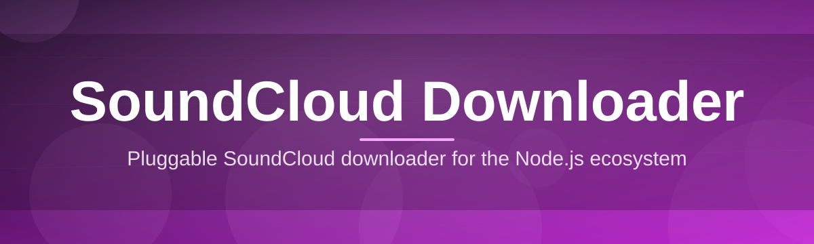

# soundcloud-downloader-tool 🎧🧡

  

*Grab any track, set, or playlist off SoundCloud and keep it in your pocket — no browser tab required.*

  

---

## 📡 Overview

**soundcloud-downloader-tool** is a lightweight Windows companion app built for one job: turning a SoundCloud link into a clean local audio file, fast. Instead of juggling browser extensions, sketchy converter sites, or ten-tab workflows, you paste a URL, pick a format, and let the tool do the plumbing — resolving stream manifests, stitching segments, and tagging the result so it actually looks right in your music library.

> [!NOTE]
> This project exists because SoundCloud's own client is great for *listening*, but offers zero native way to keep tracks for offline use — DJs prepping sets, podcasters archiving guest mixes, and commuters with spotty subway signal all hit the same wall. This tool is the bridge.

Under the hood it's just a focused desktop utility — a URL parser, a resolver, a queue manager, and an exporter — wrapped in an interface that doesn't make you feel like you're operating a terminal. Whether you're pulling a single track for a mixtape or bulk-archiving an entire artist page, the goal is the same: **predictable output, minimal friction, no clutter.**

It's built for:

- 🎚️ **DJs & producers** archiving reference tracks and demo mixes
- 🎙️ **Podcasters** pulling guest audio or interview segments hosted on SoundCloud
- 🚇 **Commuters & travelers** who want offline playlists without data burn
- 📼 **Archivists** preserving sets, live recordings, or limited-run uploads before they vanish

---

---

## ⚡ What It Actually Does

Here's the rundown of capabilities that make this tool worth keeping pinned to your taskbar:

- **Link-to-file in one paste** — drop a track, playlist, or set URL, hit resolve, and the tool handles the rest without extra clicks.
- **Bulk playlist harvesting** — feed it an entire SoundCloud set or artist page and it queues every track automatically, in order.
- **Format flexibility** — export as MP3 or the original stream codec, depending on what your library or DAW actually needs.
- **Auto-tagging on export** — title, artist, artwork, and album metadata get written into the file so it doesn't show up as "Unknown Track 01" in your player.
- **Smart queue with retry logic** — if a track hiccups mid-download, it retries silently instead of nuking the whole batch.
- **Bandwidth-aware transfers** — throttling controls so a big playlist grab doesn't choke the rest of your internet connection.
- **Zero-clutter local library view** — see everything you've pulled, re-open folders, or re-export without hunting through Downloads.
- **Dark/light theme switching** — because staring at a bright white queue at 2am is nobody's idea of fun.

> [!TIP]
> Grabbing a whole set? Paste the *set URL*, not an individual track link inside it — the tool detects playlists automatically and queues every track in the correct order.

---

## 🚀 Getting Started

Four steps, no dependencies, no command line:

1. **Visit the landing page** using the download button above.
2. **Download the installer** for Windows — it's a single standalone file.
3. **Run it** — no admin rights, no bundled toolchains, no separate runtime installs.
4. **Paste a SoundCloud link** into the app bar and hit resolve. That's it.

🧩 First-run checklist (click to expand)

 

- Confirm your default download folder in **Settings → Output Path**
- Pick your preferred export format (MP3 recommended for general use)
- Toggle **auto-tagging** on if you want metadata written automatically
- Set a bandwidth cap if you're on a shared or metered connection

---

## 🖥️ System Requirements

| Component        | Minimum                          |
|-------------------|-----------------------------------|
| OS                | Windows 10 (64-bit) or Windows 11 |
| RAM               | 4 GB                               |
| Disk Space        | 150 MB free + space for downloads |
| Internet          | Stable broadband connection        |
| Dependencies      | None — fully standalone            |

  

> [!IMPORTANT]
> No Python, no Node, no separate media framework required. The app ships everything it needs in a single executable — that's the whole point.

---

## 🔧 How It Works

The pipeline behind every download is intentionally simple:

1. **URL intake** — you paste a link; the app validates it's a real SoundCloud track/playlist reference.
2. **Metadata resolution** — the tool queries track info (title, artist, artwork, duration) before touching any audio.
3. **Stream fetch** — the audio stream is located and pulled down in segments.
4. **Reassembly & export** — segments are stitched, converted if needed, and tagged.
5. **Local delivery** — the finished file lands in your chosen output folder, ready to play.

---

## 🩹 Troubleshooting

<strong>The app says "Unable to resolve link" — what now?</strong>

 

Double-check the URL is a direct SoundCloud track, set, or playlist link (not a shortened redirect from another app). Private or geo-restricted uploads may also fail to resolve.

<strong>My download finished but the file has no artwork or title.</strong>

 

Auto-tagging might be disabled. Head to **Settings → Metadata** and enable it, then re-export the track.

<strong>Playlist downloads stop partway through.</strong>

 

This is usually a network blip. The queue has built-in retry logic, but if it stalls completely, pause and resume the queue manually from the sidebar.

<strong>Exported MP3 sounds slightly different from the stream.</strong>

 

Some tracks are re-encoded during export to standardize bitrate. Switch to "original codec" export mode in Settings if you want the closest match to the source stream.

<strong>The app won't launch after a Windows update.</strong>

 

Re-run the installer from the landing page — Windows security policies occasionally require re-approval after major OS updates.

---

## 🎛️ UI & UX Details

The interface leans minimal — one main queue, one settings panel, no nested menu labyrinths.

- ⌨️ **Keyboard shortcuts:**

  | Shortcut | Action |
  |----------|--------|
  | `Ctrl + V` | Paste link into resolver bar |
  | `Ctrl + Enter` | Start queued downloads |
  | `Ctrl + ,` | Open Settings |
  | `Ctrl + D` | Toggle dark/light theme |
  | `Esc` | Cancel active resolve |

- 🌗 **Themes:** Dark (default), Light, and a high-contrast mode for accessibility.
- 🎚️ **Adjustable settings:** output path, export format, bandwidth cap, auto-tagging, queue concurrency.
- 📂 **Library view:** shows everything downloaded this session with quick "open folder" and "re-export" actions.

> [!WARNING]
> Changing the output path mid-queue won't move files already in progress — finish or cancel the current batch first.

---

## 🤝 Contributing & Community

This project grows because people actually use it and tell us what's broken.

- 🐛 Found a bug? Open an issue with your Windows version and the link type that failed.
- 💡 Have a feature idea? Discussions are open — playlist filters and speed presets are popular requests.
- 🧪 Want to test pre-release builds? Watch the repo for beta tags.

> [!TIP]
> The most useful bug reports include the exact SoundCloud URL format (track/set/playlist) and whether the issue happens on the first attempt or only after several downloads.

---

## 📜 License

Released under the [MIT License](LICENSE) — 2026. Use it, fork it, remix it, just don't strip the license notice.

---

## ⚠️ Disclaimer

This tool is intended for personal, offline use of content you have the rights to download — respect artists, respect SoundCloud's terms of service, and don't redistribute copyrighted audio without permission. The maintainers of this project are not responsible for how it's used.

---

